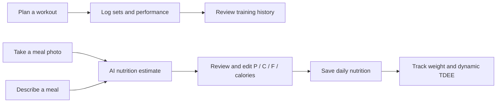
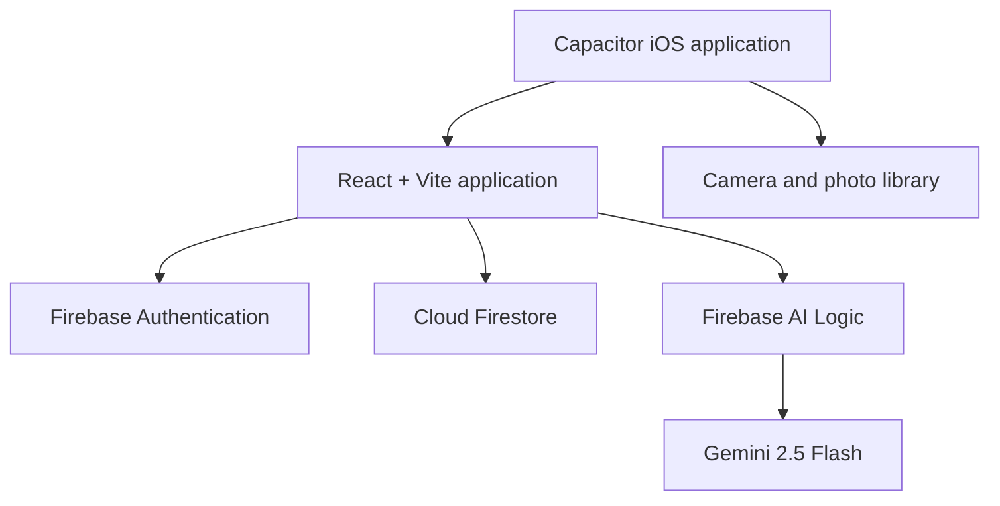

<div align="center">
  

  # Elite Tracker

  **A mobile-first training and nutrition companion for consistent, measurable progress.**

  [Open the Web App](https://hypertrophy-tracker-chi.vercel.app) ·
  [View the Repository](https://github.com/kietvohoanganh/hypertrophy-tracker)

  [](https://react.dev/)
  [](https://vite.dev/)
  [](https://firebase.google.com/)
  [](https://capacitorjs.com/)
</div>

## Overview

Elite Tracker combines workout programming, performance history, AI-assisted
meal logging, body-weight tracking, and adaptive calorie insights in one
responsive application. It is designed for fast daily use on the web and can
also be packaged as a native iOS app with Capacitor.

The nutrition workflow is intentionally simple: take a meal photo or describe
what you ate, review the estimated portions and macros, edit anything that
looks inaccurate, and save the result to today's log.

## Core Features

| Area | Capabilities |
| --- | --- |
| **Workout tracking** | Record sets, repetitions, load, completion state, and session duration |
| **Workout templates** | Create, edit, reuse, and import structured training plans |
| **Exercise library** | Browse built-in movements, add custom exercises, and save favorites |
| **Performance history** | Review previous sessions and inspect exercise-specific progress |
| **Meal photo analysis** | Estimate food items, portions, calories, protein, carbohydrates, and fat from an image |
| **Meal description analysis** | Turn a natural-language meal description into an editable nutrition estimate |
| **Nutrition review** | Correct food names, serving sizes, calories, and macros before saving |
| **Daily nutrition log** | Track calorie and macro totals alongside body weight |
| **Dynamic TDEE** | Estimate real-world energy expenditure from intake and weight trends |
| **Cross-platform experience** | Responsive web interface with native iOS camera and photo-library support |

## Product Flow



## Technology

- **Frontend:** React 19 and Vite 8
- **Authentication:** Firebase Authentication
- **Database:** Cloud Firestore
- **AI nutrition:** Firebase AI Logic with Gemini 2.5 Flash
- **Native runtime:** Capacitor 8
- **Camera access:** Capacitor Camera
- **Charts:** Recharts
- **Workout image parsing:** Vision-based OCR for local macOS development

## Architecture



Meal analysis uses Firebase AI Logic directly from the application. The project
does not require a third-party food-search API key.

## Getting Started

### Requirements

- Node.js 20 or newer
- npm
- A Firebase project
- Xcode for iOS development

### Installation

```bash
git clone https://github.com/kietvohoanganh/hypertrophy-tracker.git
cd hypertrophy-tracker
npm install
cp .env.example .env.local
npm run dev
```

Vite serves the local application at `http://127.0.0.1:5174`.

## Firebase Setup

1. Create a Firebase web application.
2. Enable Email/Password Authentication.
3. Create a Cloud Firestore database.
4. Replace the Firebase web configuration in `src/App.jsx`.
5. Deploy the rules in `firestore.rules`.
6. Enable Firebase AI Logic for the project.
7. Enable Firebase App Check before production use.

Firebase web configuration identifies the project and is expected to be present
in client code. Data access must be protected by Authentication, Firestore
Security Rules, API restrictions, and App Check.

## AI Meal Analysis

The meal analyzer supports two input modes:

- **Photo:** capture a meal with the native camera or choose an image.
- **Description:** enter foods and portions in natural language.

The result contains editable meal items with estimated grams, calories,
protein, carbohydrates, fat, and confidence. Nothing is added to the daily log
until the user reviews and confirms the estimate.

Nutrition estimates are informational and should not replace professional
medical or dietary advice.

## Workout Image Import

During local macOS development, workout-template screenshots can be parsed
through the Vite middleware and the Vision OCR script in
`scripts/ocr-workout-image.swift`.

For interface testing without OCR, set:

```bash
VITE_USE_MOCK_IMAGE_PARSER=true
```

## Available Commands

| Command | Purpose |
| --- | --- |
| `npm run dev` | Start the local development server |
| `npm run build` | Create an optimized production build |
| `npm run preview` | Preview the production build locally |
| `npm run lint` | Run ESLint across the project |

## iOS

Build the web application and synchronize it with the native project:

```bash
npm run build
npx cap sync ios
npx cap open ios
```

Camera and photo-library permission descriptions are defined in
`ios/App/App/Info.plist`.

## Data Model

Authenticated user data is isolated beneath the user's Firebase UID:

```text
users/{userId}/daily_logs/{date}
users/{userId}/history/{workoutId}
users/{userId}/workout_templates/{templateId}
users/{userId}/custom_exercises/{exerciseId}
users/{userId}/preferences/exercises
```

## Project Structure

```text
.
├── public/                 # Web application icons and manifest
├── scripts/                # Local OCR tooling
├── src/
│   ├── components/         # Reusable interface components
│   ├── services/           # Meal analysis and image parsing
│   ├── utils/              # Exercise and template utilities
│   ├── App.jsx             # Main application and Firebase integration
│   └── main.jsx            # React entry point
├── ios/                    # Capacitor iOS project
├── firestore.rules         # User-scoped Firestore access rules
├── capacitor.config.ts
└── vite.config.js
```

## Production Checklist

- Enable Firebase App Check for web and iOS.
- Confirm the Firebase API key is restricted to required Firebase services.
- Review Firebase AI Logic quotas, usage, and billing alerts.
- Test Firestore rules with authenticated and unauthenticated requests.
- Validate camera permissions and meal analysis on a physical iOS device.
- Run `npm run lint`, `npm run build`, and `npx cap sync ios`.

---

<div align="center">
  Built for disciplined training, practical nutrition tracking, and long-term progress.
</div>
